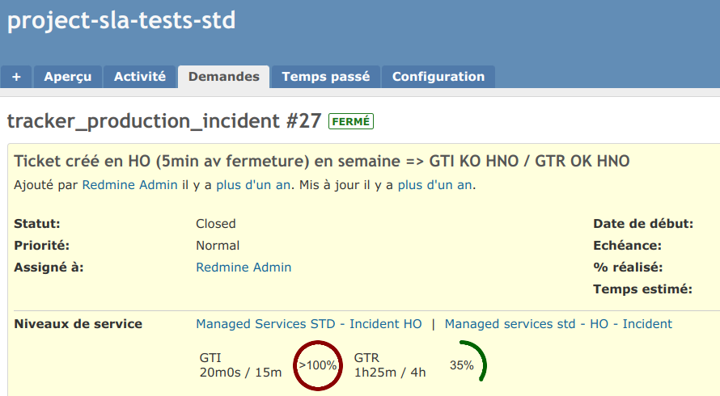

# redmine_sla




------------------------------------------------------------------------

## Overview

-   Website: https://github.com/likehopper/redmine_sla
-   Code repository: git@github.com:likehopper/redmine_sla.git
-   Redmine plugins directory:
    https://www.redmine.org/plugins/redmine_sla

------------------------------------------------------------------------

## Digest

**redmine_sla** provides advanced Service Level Agreement management for
Redmine.

It enables precise SLA computation based on:

-   Project trackers
-   Working calendars (HO / HNO)
-   SLA levels and priorities
-   Response and resolution terms
-   PostgreSQL time-based procedures

SLA compliance is calculated directly at the database level using
PL/pgSQL, ensuring:

-   Deterministic computation
-   Accurate working-hours handling
-   High performance on large datasets

------------------------------------------------------------------------

## Why redmine_sla?

Many SLA implementations rely exclusively on Ruby time computations.

This plugin delegates SLA calculation to **PostgreSQL stored
procedures**, allowing:

-   Accurate handling of working schedules
-   Holiday-aware deadlines
-   Efficient computation on large issue volumes
-   Predictable and reproducible results

The engine is designed for production environments.

------------------------------------------------------------------------

## Core Concepts

    SLA
     ├── SLA Level
     │     └── SLA Terms (Response / Resolution)
     ├── SLA Calendar
     │     ├── Weekly Schedule
     │     └── Holidays
     └── SLA Status Mapping

------------------------------------------------------------------------

## Features

### Core Engine

-   PostgreSQL PL/pgSQL SLA computation
-   Working calendar awareness (HO / HNO)
-   Response & resolution deadlines
-   SLA compliance percentage
-   Configurable update step
-   Configurable calculation time zone

### Administration (Global Level)

Fully manageable through UI and REST API:

-   SLAs
-   SLA Types
-   SLA Statuses
-   SLA Holidays
-   SLA Calendars
-   Weekly schedules
-   Calendar-specific holidays
-   SLA Levels
-   SLA Terms

### Project Integration

-   SLA assignment per tracker
-   Role-based permissions
-   SLA visibility control
-   SLA columns in issue list
-   SLA filtering
-   SLA summary in issue view
-   Responsive display

### Time Logs

-   SLA filtering
-   SLA columns in time log list

### Automation

-   Manual SLA update task
-   Cron-based update support
-   CSV-based fixture builder

------------------------------------------------------------------------

## Localisations

-   English
-   French

------------------------------------------------------------------------

## Roadmap (Non-Prioritized)

### UX Improvements

-   Graphical schedule editor
-   Tabular SLA term editor
-   Group issues by SLA compliance
-   Improved calendar visualization

### Functional Extensions

-   Per-project time zone
-   Alert thresholds & notifications
-   SLA export/import
-   SLA summary in issue reports

### Technical Improvements

-   Cache invalidation strategy
-   Full functional test coverage
-   Column visibility based on module access

------------------------------------------------------------------------

# Installation

## Prerequisites

| Name               | requirement                      |
|--------------------|----------------------------------|
| `Redmine`          | >= 5.0                           |
| `Ruby`             | >= 2.7                           |
| `Rails`            | >= 6.1                           |
| `Database`         | PostgreSQL >= 11                 |

------------------------------------------------------------------------

### ⚠ PostgreSQL Requirement

This plugin relies heavily on:

-   PostgreSQL views
-   PL/pgSQL stored procedures
-   SQL schema format

In `config/application.rb`:

``` ruby
config.active_record.schema_format = :sql
```

This is mandatory for proper installation.

MySQL and SQLite are **not supported**.

------------------------------------------------------------------------

### Database Configuration

Ensure PostgreSQL datestyle is set to ISO:

``` sql
ALTER DATABASE "redmine_db" SET datestyle="ISO,MDY";
```

Recommended configuration:

``` ruby
config.active_record.default_timezone = :local
```

Prefer global timezone configuration set to:

    Etc/UTC

------------------------------------------------------------------------

## Install

1.  Copy `redmine_sla` into Redmine's `plugins` directory\
2.  Run:

``` bash
bundle install
```

3.  Migrate:

``` bash
rake redmine:plugins:migrate NAME=redmine_sla
```

4.  Restart application server

Plugin is ready to use.

------------------------------------------------------------------------

## Uninstall

``` bash
rake redmine:plugins:migrate NAME=redmine_sla VERSION=0
```

Then remove the plugin folder:

``` bash
rm -r redmine_sla
```

Restart application server.

------------------------------------------------------------------------

# Documentation

-   [Functional tests](doc/TESTING.md)
-   [Conceptual Data Model](doc/MCD.md)
-   [Step-by-step use case](doc/USECASE.md)
    -   [Example 01](doc/EXAMPLE-01.md)
    -   [Example 02](doc/EXAMPLE-02.md)
    -   [Example 03](doc/EXAMPLE-03.md)
    -   [Example 04](doc/EXAMPLE-04.md)
    -   [Example 05](doc/EXAMPLE-04.md)
-   [SLA Compute Explanation](doc/COMPUTE.md)
-   [Plugin settings](doc/SETTINGS.md)
-   [API Rest for SLA](doc/API.md)
-   [Tasks](doc/TASKS.md)
-   [Change log](CHANGELOG.md)
-   [License](LICENSE)

------------------------------------------------------------------------

## Credits

Icons created by Freepik -- Flaticon
https://www.flaticon.com/authors/freepik