# Example n°1 : Simple service levels with only response time

For a support service, open Monday to Friday from 9:30 a.m. to 12:30 a.m. and from 2:00 p.m. to 6:00 p.m., we want to monitor only commitments on issues handling times.

**Calendar Support Tracker**
| Dow       | Start time  |	End time  |
|-----------|-------------|-----------|
| Monday    |    09:30    |   12:30   |
| Monday    |    14:00    |   18:00   |
| Tuesday   |    09:30    |   12:30   |
| Tuesday   |    14:00    |   18:00   |
| Wednesday |    09:30    |   12:30   |
| Wednesday |    14:00    |   18:00   |
| Thursday  |    09:30    |   12:30   |
| Thursday  |    14:00    |   18:00   |
| Friday    |    09:30    |   12:30   |
| Friday    |    14:00    |   18:00   |

Outside these hours, or during the defined vacation days, the calculation of times will be suspended.
The delay will be calculated as long as the issue is in the « new » status during the working hours above. 

In the projects, we will apply this SLA to the tracker « Support » :

**Level Support Tracker**
| Issue priorities / SLA Levels | Response time |
|-------------------------------|---------------|
| Minor                         |      24h      |
| Major                         |       9h      |
| blocker                       |       4h      |

## Create SLA

The SLA configuration bring together the entire definition of the SLA

To begin, go to `Administration » SLA Global settings` (https://[redmine-host]/sla/slas). Add "Sla Support Tracker" as new "Service Level Agreements".

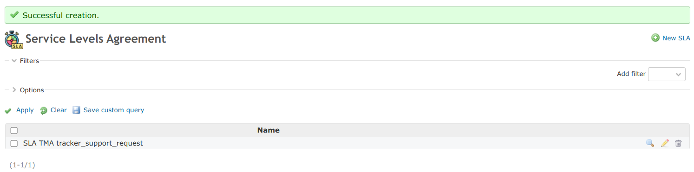

So, this will bring together the entire definition of the SLA that we described in the introduction.

## Create SLA Types

The SLA Types' configuration define the various commitments possibles.

Go to `Administration » SLA Global settings » SLA Types` (https://[redmine-host]/sla/types). Add "Response time" as new "SLA Type".

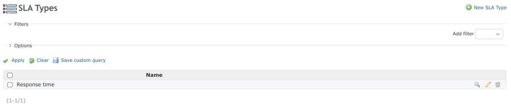

Restart Redmine for applys patches with all sla types:
- Issue : for display columns of the respect of each sla type in issues report
- IssueQuery : for filter issues on the respect of each sla type in issues report
- TimeEntry : for display columns of the respect of each sla type in time entries report
- TimeEntryQuery : for filter issues on the respect of each sla type in time entries report

## Create SLA Statuses

The SLA Statuses' configuration allows to define for which statuses the time elapses.

Go to `Administration » SLA Global settings » SLA Statuses` (https://[redmine-host]/sla/statuses). Add "SLA Statuses" for "Response time" with this statuses :
- New

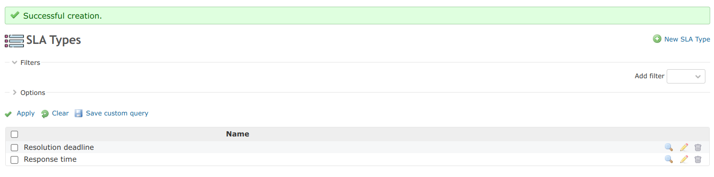

The addition of this tuple indicates that the ticket creation delay should be calculated only when then issue was is in this status (i.e. while the ticket is in this status).

## Create SLA Holidays

This module is used to list all the holidays (non-working days or even exceptional closing days) that will be needed in the SLA duration count.

Go to `Administration » SLA Global settings » SLA Holidays` ( https://[redmine-host]/sla/holidays). Add new "SLA Holidays" like "New Year's Day" for example, and all the others to come for your tests (even if they are not real public holidays).

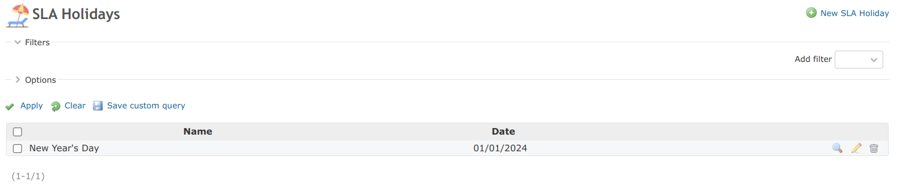

## Create SLA Calendar (& SLA Calendar' Schedule)

The SLA calendar is important, it allows to define the working hours of the week.

If the "match" field is checked, then the issue can be opened in this time slot (opening hours). If the time is declared with the "match" field unchecked, then the issue cannot be opened in this slot, however the time calculation can continue on this slot (non-working hours).

Typically, for support activities, deadlines are suspended outside business hours. If an issue is opened during non-working hours, then the calculation starts at the next working hour. Conversely, in the case of web hosting, an issue can be opened at any time and continues regardless of the time. If an exit is opened during working hours then it continues during non-working hours and vice versa.

Go to Administration » SLA Global settings » SLA Calendar ( https://[redmine-host]/sla/calendars ). Add "Calendar Support Tracker" as new "SLA Calendar"

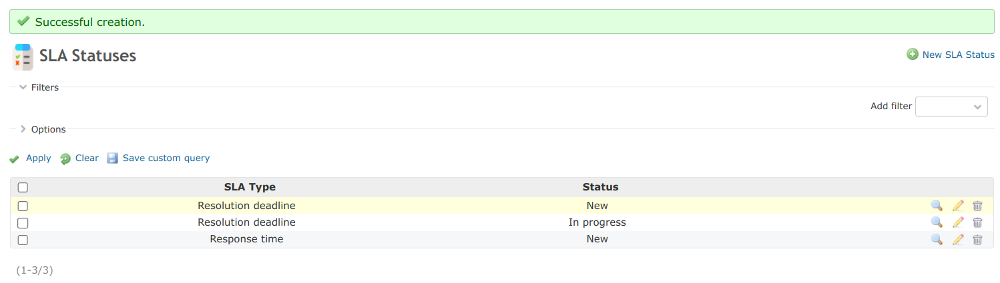

Edit this SLA Calendar and add schedules :

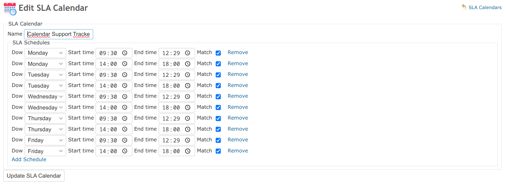

We are here in the case of a support service, so only the opening hours count. Tickets are processed during working hours and counting is suspended outside these hours.

> **_NOTE:_** These are the intervals from a start time to an end time, so the time is usually stopped by subtracting one minute from the end time. Indeed, taking a schedule of 8am to 9am, so to get well 60 minutes, it's therefore necessary to declare from 8am to 8:59am.

## Create SLA Calendars' Holidays

So, we can create several SLA Calendars with SLA Schedules. For each SLA Calendar, you can also assign SLA Holidays.

For SLA Calendars' Holidays, the "match" field has the opposite meaning to SLA Calendar' Schedules. Indeed, for SLA Calendar' Schedules, the hours worked were declared. For SLA Calendars' Holidays, the hours not worked are declared. 
By default, we add a public holiday to remove it from the calculations. However, if the "match" field is checked, then the time will be counted. However, if a ticket is open on this slot, then it cannot start until the next working hour.

Go to `Administration » SLA Global settings » SLA Calendars' Holidays` (https://[redmine-host]/sla/calendar_holidays). Add new "SLA Calendars' Holidays" :

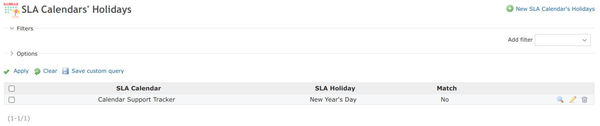

For our example, which is a support service, public holidays are equivalent to times that shouldn't be counted.

## Create SLA Levels

After declaring SLAs and SLA Schedules, they can be linked to define service levels. In other words, the SLA Levels make it possible to know the moment "when" commitments will apply.

Go to `Administration » SLA Global settings » SLA Levels` (https://[redmine-host]/sla/levels). Add "Level Support" as new "SLA Levels"

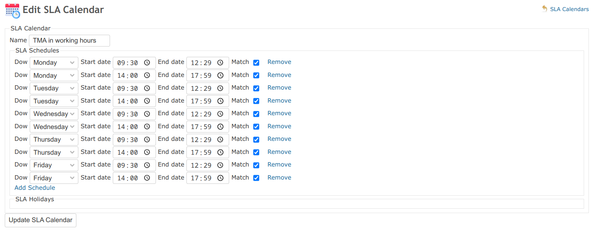

## Create SLA Terms

Finally, we can define the SLA Terms. For an SLA Level, an SLA Type and a priority, you can define a time commitment (in minutes).

Go to `Administration » SLA Global settings » SLA Terms` (https://[redmine-host]/sla/level_terms). Add "Terms Support Tracker" for each SLA Type / Priority as new "SLA Terms"

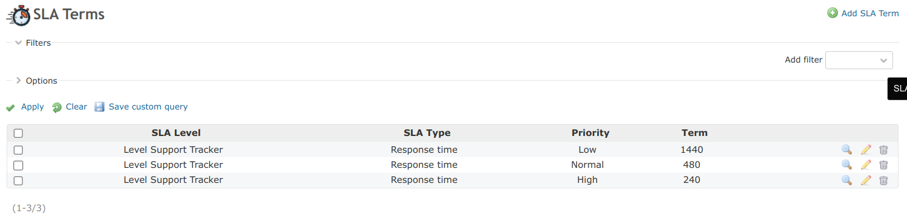

## Apply SLA to a Project

Go to your project' settings ( https://[redmine-host]/projects/[project-identifier]/settings ). Active SLA module for your project.

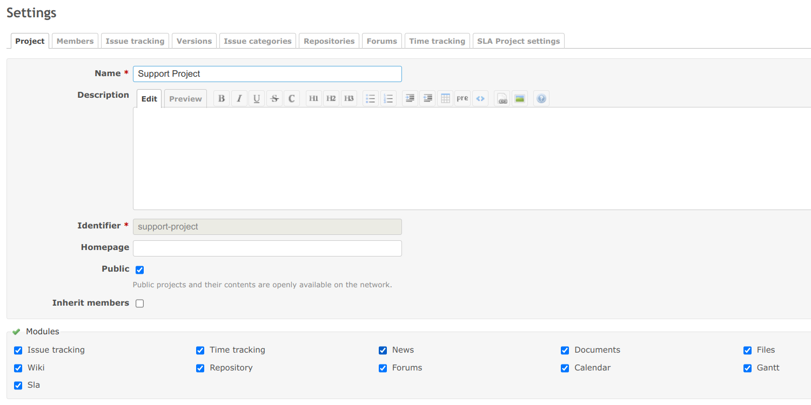

The tab should appear `SLA Project settings`, go to this tab (http://[redmine-host]/projects/[project-identifier]/settings/slas). With "New SLA project's tracker" définie à SLA for a tracker.

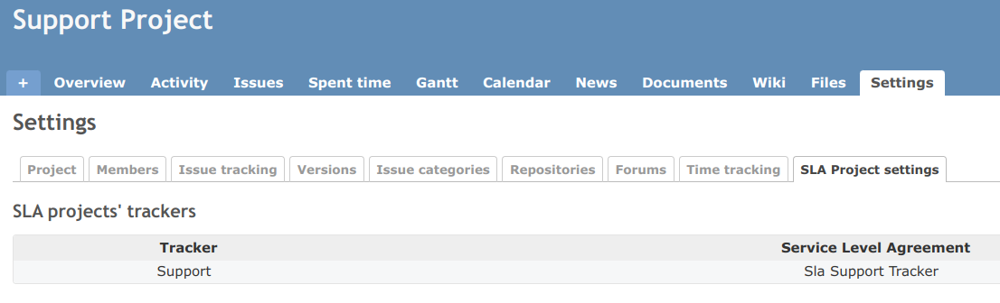

## View SLA into an issue

When you go to a project's issue, you should see the SLA appear if it matches with the status and priority.

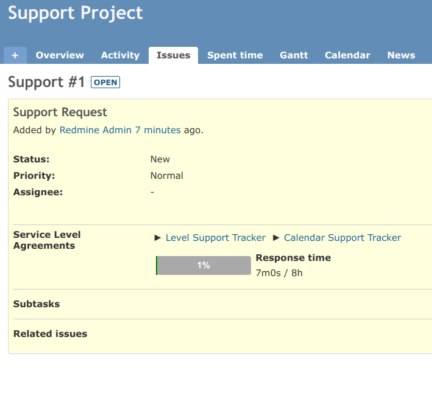

## implementation of this example with the APIs

You can deploy this example on a fresh Redmine with this bash script [Script Example 01](scripts/EXAMPLE-01.bash) which use the plugin's API.

> **_REQUIREMENTS:_** The code requires curl and jq commands.

> **_NOTE:_** The code has not been optimized to precisely highlight the use of APIs.

## Rôles

Until then, you were an administrator. However, in order for the members of your project to be able to see the SLAs, or even manage their activation within the project, you must grant them this right.

Got to `Administration » Roles and permissions` (http://[redmine-host]/roles). Edit a role (http://[redmine-host]/roles/[role-id]/edit) to check "View SLA" (ex: for manager and developer) and/or "Manage SLA" (ex: for manager).
