# EXAMPLE-01 — Simple service levels with *Response time* only

This first example introduces the **core concepts** of the *Redmine SLA* plugin through the simplest possible use case.

The goal is to understand **how SLA time is calculated**, **when it is counted**, and **how it is displayed on an issue**, without any advanced configuration.

This example is the **foundation** for all the following ones.

---

## What we want to achieve

We manage a **support service** with clearly defined working hours.

For each issue, we want to measure **how long it takes to respond**, depending on its **priority**, while respecting business hours.

### Business rules

- The service is open **Monday to Friday**
- Working hours are:
  - **09:30 → 12:30**
  - **14:00 → 18:00**
- Outside these hours:
  - SLA time **does not elapse**
- Public holidays are **not working days**

### SLA objective

We want to measure **Response time** (also called *GTI*):
> the time between issue creation and the first handling phase.

The allowed response time depends on the **Redmine issue priority**:

| Priority | Response time |
|--------|---------------|
| Low    | 24 hours |
| Normal | 8 hours |
| High   | 4 hours |

---

## Key concepts introduced in this example

This example introduces **only the minimal SLA chain**:

```
SLA
 └─ SLA Type (Response time)
     └─ SLA Status (New)
         └─ SLA Calendar (working hours)
             └─ SLA Level
                 └─ SLA Terms (per priority)
                     └─ Project mapping
                         └─ Issue display
```

Each concept is configured step by step below.

---

## 1. Creating the SLA

The **SLA** is the top-level object.  
It represents a *service contract* that will later be attached to projects and trackers.

Go to:

`Administration → SLA Global settings → Service Level Agreements`

Create a new SLA named **“SLA Support”**.

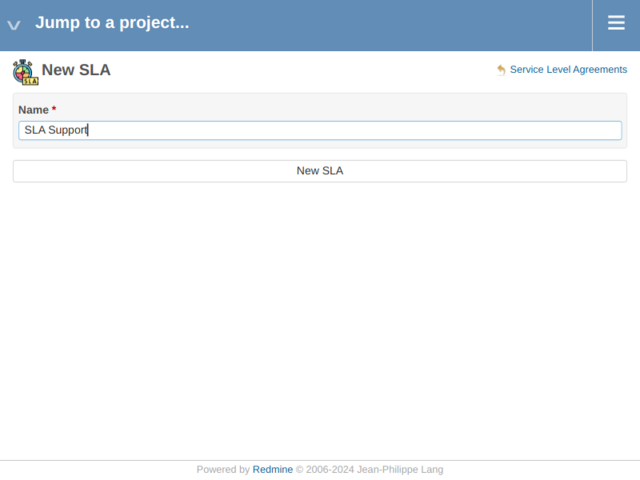

After saving, Redmine confirms the SLA creation:

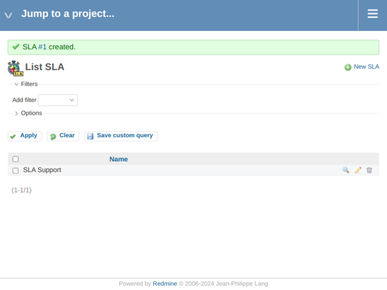

At this stage, the SLA exists but **does nothing yet**.

---

## 2. Defining what we measure: the SLA Type

An **SLA Type** defines *what is measured*.

In this example, we measure **Response time** only.

Go to:

`Administration → SLA Global settings → SLA Types`

Create a new SLA Type named **“Response time”**.

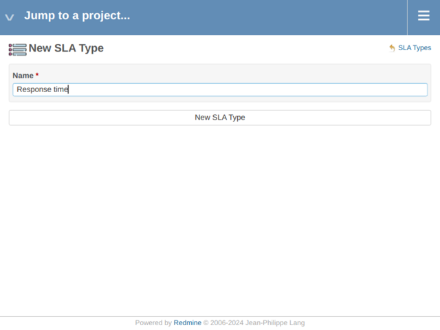

After saving, Redmine confirms the SLA Type creation.

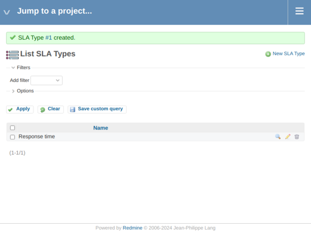

> At this point, we know *what* we want to measure, but not *when*.

---

## 3. Defining when time elapses: SLA Statuses

SLA time should not always run.  
It usually depends on the **issue status**.

For a response time, we typically measure the delay **while the issue is still new**.

Go to:

`Administration → SLA Global settings → SLA Statuses`

Create a new mapping:

- **SLA Type:** Response time
- **Status:** New

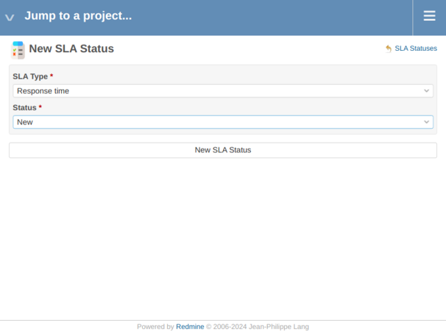

After saving, Redmine confirms the mapping.

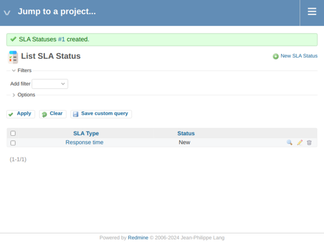

➡️ From now on, **Response time is counted only while the issue is in status “New”**.

---

## 4. Defining working hours: the SLA Calendar

The **SLA Calendar** defines **when time is allowed to elapse**.

In this example, time is counted **only during working hours**.

Go to:

`Administration → SLA Global settings → SLA Calendars`

Create a calendar named **“Calendar Support”**, and define the weekly schedules.

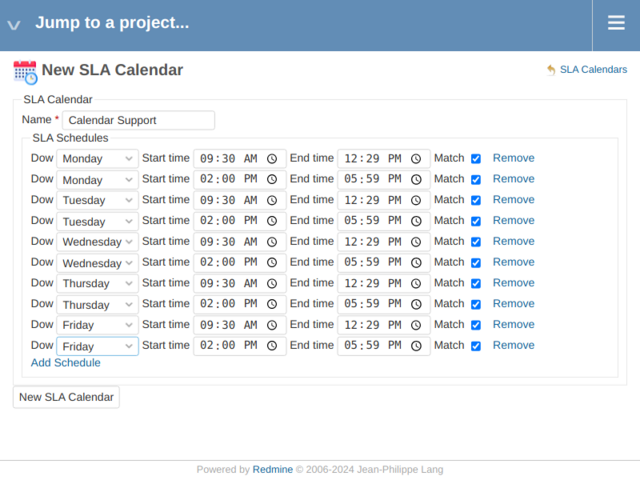

After saving, Redmine confirms the calendar creation.

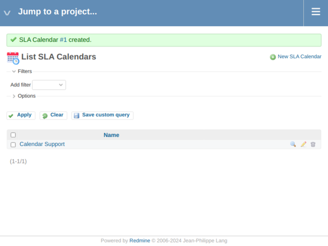

### About time slots

Time slots are defined as **minute-based intervals**.

To represent a range such as *09:30 → 12:30*, the end time is usually stored as *12:29*.

This ensures the exact number of minutes is counted.

---

## 5. Defining non-working days: SLA Holidays

Holidays represent **days when the service is closed**.

Go to:

`Administration → SLA Global settings → SLA Holidays`

Create at least one holiday (for example *New Year’s Day*).

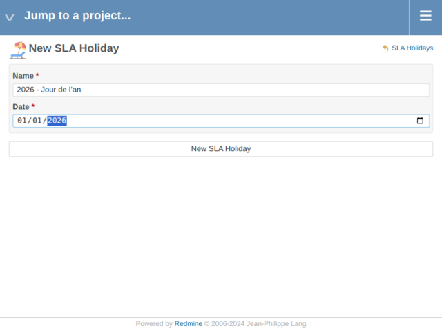

Then add the other holidays needed and verify the list.

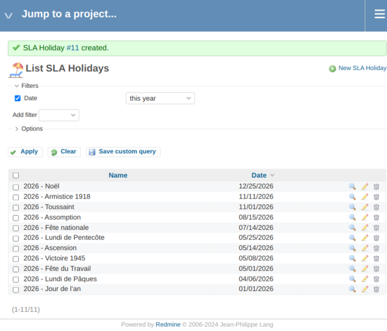

In this example, holidays are **not counted** as working time.

---

## 6. Linking holidays to the calendar

Holidays must be attached to a calendar to be taken into account.

Go to:

`Administration → SLA Global settings → SLA Calendars’ Holidays`

Create a mapping:

- **Calendar:** Calendar Support
- **Holiday:** select a holiday
- **Match:** unchecked

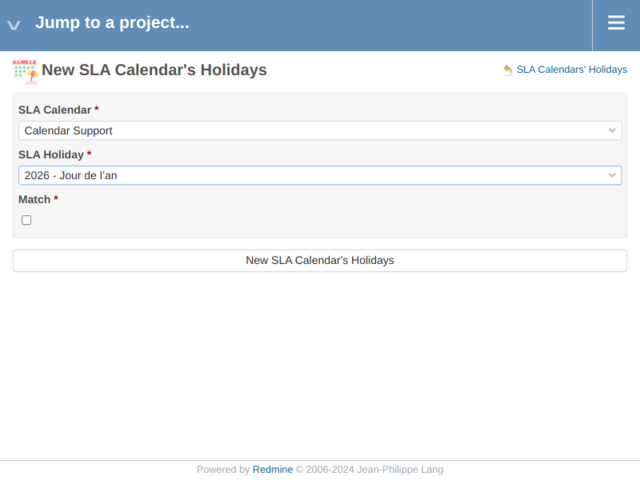

Repeat for all holidays.

Verify the list once completed.

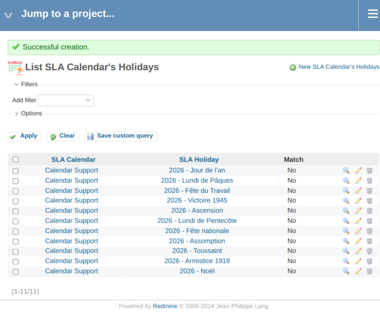

➡️ During these days, **SLA time is suspended**.

---

## 7. Creating the SLA Level

An **SLA Level** links together:
- an SLA
- a calendar

It represents *when* the commitments apply.

Go to:

`Administration → SLA Global settings → SLA Levels`

Create a level named **“Level Support”** and associate it with:
- **SLA:** SLA Support
- **Calendar:** Calendar Support

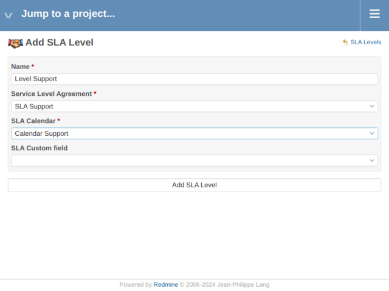

After saving, Redmine confirms the SLA Level creation.


---

## 8. Defining the commitments: SLA Terms

**SLA Terms** define the actual targets.

They combine:
- an SLA Level
- an SLA Type
- a Redmine priority
- a duration (in minutes)

Go to:

`Administration → SLA Global settings → SLA Terms`

Create the following terms for **Level Support** and **Response time**:

| Priority | Minutes |
|--------|---------|
| Low    | 1440 |
| Normal | 480 |
| High   | 240 |

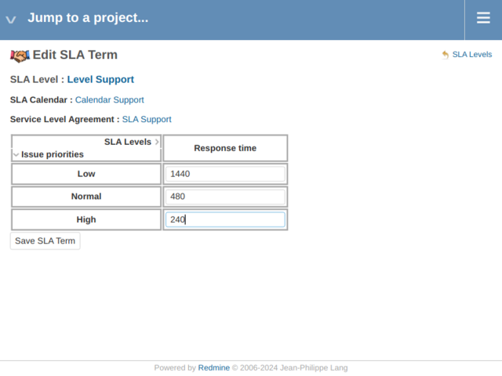

After saving, Redmine confirms the SLA Terms creation.

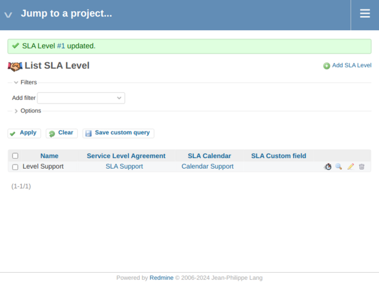

➡️ The SLA logic is now fully defined.

---

## 9. Applying the SLA to a project

### 9.1 Enable the SLA module

Go to your project:

`Project → Settings → Modules`

Enable the **SLA** module.

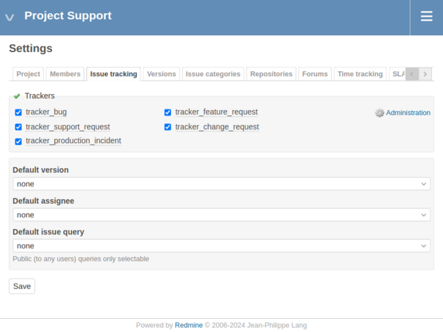

Save and confirm.

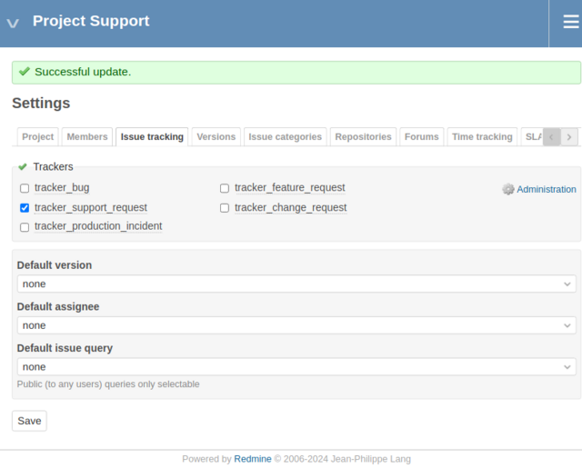

---

### 9.2 Map a tracker to the SLA

Go to:

`Project → Settings → SLA`

Create a new mapping:
- **Tracker:** Support
- **SLA:** SLA Support

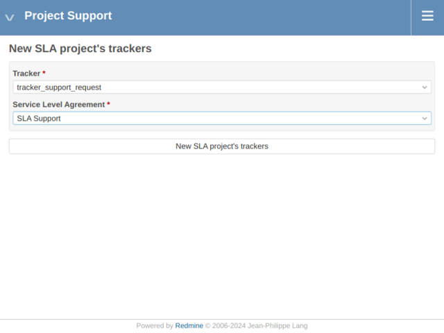

Verify the mapping.

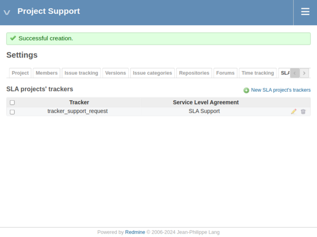

---

## 10. Viewing the SLA on an issue

Create or open an issue with:
- **Status:** New
- **Priority:** Low, Normal, or High

The SLA block appears on the issue page.

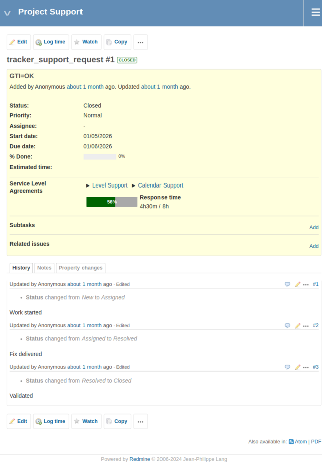

You can see:
- elapsed response time
- target time
- SLA state (respected or breached)

---

## What you learned in this example

With this first example, you learned:

- how an SLA is built step by step
- how response time is calculated
- how working hours and holidays affect SLA counting
- how priorities influence SLA targets
- how the SLA is displayed on issues

This example is intentionally **simple**.

The next examples will **extend** this configuration by introducing new concepts, without changing these foundations.