# EXAMPLE-02 — Simple service levels with *Response time* and *Resolution deadline*

This second example extends **EXAMPLE-01** by adding a **second SLA commitment** on the same issues.

In EXAMPLE-01 we measured **Response time** only.  
Here we keep the exact same foundations (working hours, priorities, one SLA, one level, one tracker), and we add **Resolution deadline**.

> **Scope reminder (do not mix examples)**  
> - No multi-SLA per tracker (this is EXAMPLE-03).
> - No custom field for priority (this is EXAMPLE-04).  
> - No HO/HNO advanced behavior (this is EXAMPLE-05).

---

## What this example adds compared to EXAMPLE-01

**One and only one new facet**:

- A second SLA Type: **Resolution deadline** (*GTR*)

Everything else remains identical to EXAMPLE-01:
- working hours only (HO)
- priorities based on **native Redmine priorities**
- a single SLA
- a single SLA Level
- a single tracker

---

## What we want to achieve

For each support issue, we want to monitor **two independent commitments**:

1. **Response time (GTI)**  
   Time allowed to acknowledge / start handling the issue.

2. **Resolution deadline (GTR)**  
   Time allowed to resolve the issue.

Both commitments:
- are counted **only during working hours**
- depend on the **issue priority**
- are displayed on the issue page

---

## Target service levels

### Response time (GTI) — same as EXAMPLE-01

| Priority | Target |
|---------|--------|
| Low     | 24h |
| Normal  | 8h |
| High    | 4h |

### Resolution deadline (GTR)

| Priority | Target (example) |
|---------|-------------------|
| Low     | 5 days |
| Normal  | 3 days |
| High    | 1 day |

> In the configuration UI, durations are stored in **minutes**.

---

## Key idea: an SLA can have multiple SLA Types

One **SLA** can group multiple **SLA Types**.  
Each SLA Type is evaluated independently:

- it can have its own statuses (when time elapses)
- it has its own SLA Terms (targets per priority)

But they can share:
- the same calendar
- the same SLA Level
- the same project mapping

---

## 1) Create the SLA (same as EXAMPLE-01)

If you start from a clean Redmine, you will create the SLA first.

Go to:

`Administration → SLA Global settings → Service Level Agreements`

Create a new SLA named **“SLA Support”**.

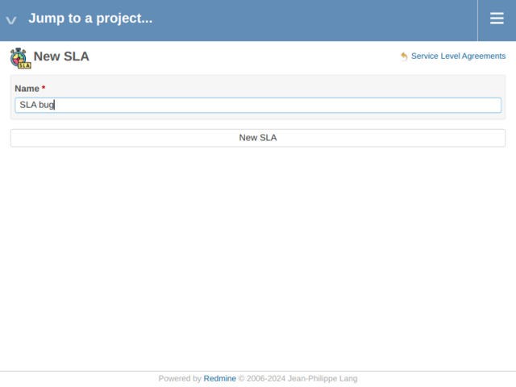

Verify it appears in the list:

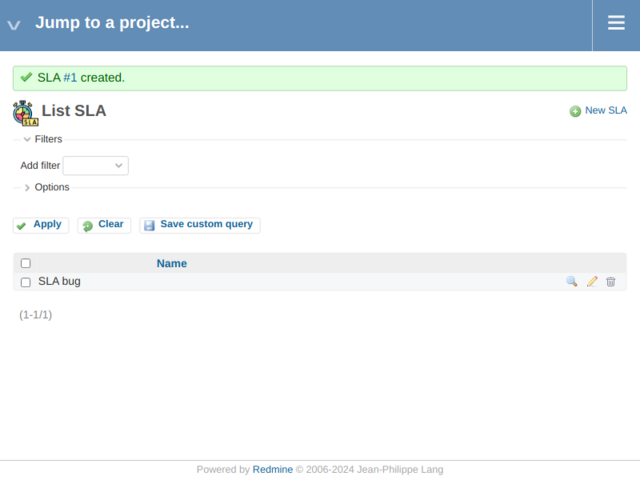

---

## 2) Create the SLA Types: Response time + Resolution deadline

Go to:

`Administration → SLA Global settings → SLA Types`

### 2.1 Response time

Create **Response time** (same as EXAMPLE-01):

### 2.2 Resolution deadline (new in this example)

Create **Resolution deadline**:

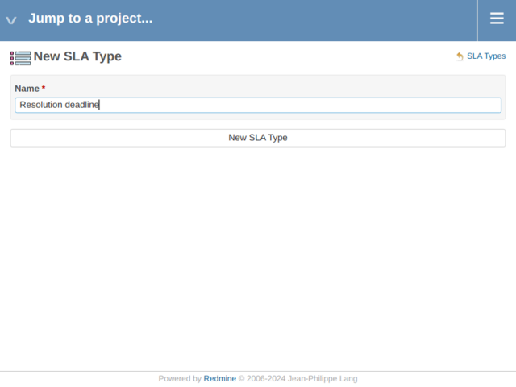

Verify both types are present:

---

## 3) Define when each SLA Type elapses (SLA Statuses)

Go to:

`Administration → SLA Global settings → SLA Statuses`

### 3.1 Response time (GTI)

Configure **Response time** to elapse while the issue is in the **New** status (same as EXAMPLE-01):

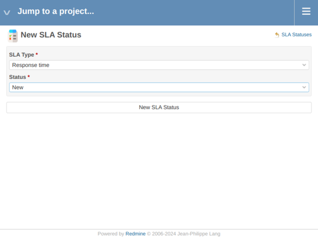

### 3.2 Resolution deadline (GTR)

Configure **Resolution deadline** to elapse on the statuses that represent “work in progress” for your workflow  
(typically *In Progress*, and optionally other intermediate statuses).

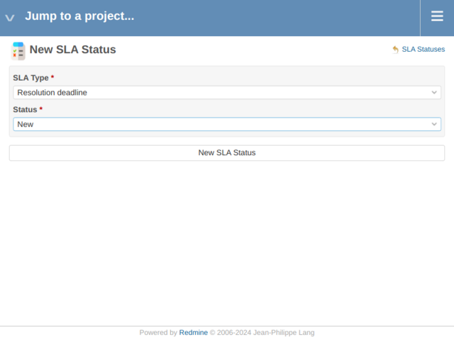

Verify the list:

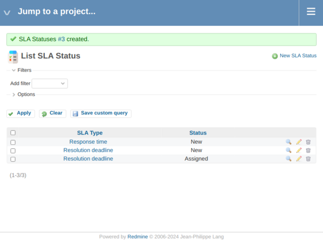

> **Pedagogical takeaway**  
> GTI and GTR can run on **different statuses**.  
> This is one of the main reasons we model them as **two SLA Types**.

---

## 4) Create the Calendar (same as EXAMPLE-01)

Go to:

`Administration → SLA Global settings → SLA Calendars`

Create **Calendar Support** and define weekly working hours:

Verify it appears:

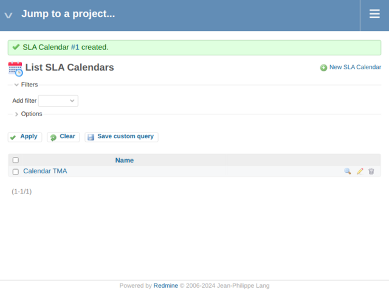

---

## 5) Create Holidays + link them to the calendar (same as EXAMPLE-01)

### 5.1 Create holidays

Go to:

`Administration → SLA Global settings → SLA Holidays`

Create at least one holiday:

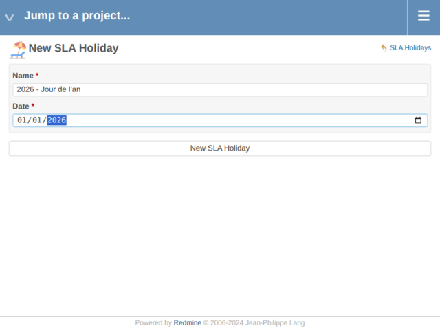

Then add the rest (no need for one screenshot per holiday) and verify the list:

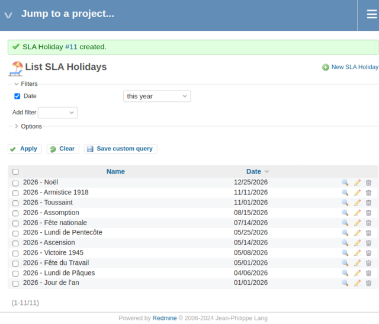

### 5.2 Assign holidays to the calendar

Go to:

`Administration → SLA Global settings → SLA Calendars’ Holidays`

Create mappings to **Calendar Support** (match unchecked for non-working days).  
One screenshot is enough; repeat for all holidays:

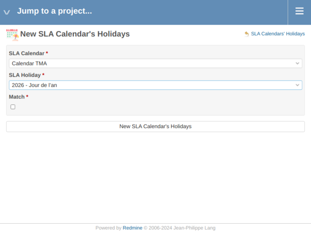

Verify the list:

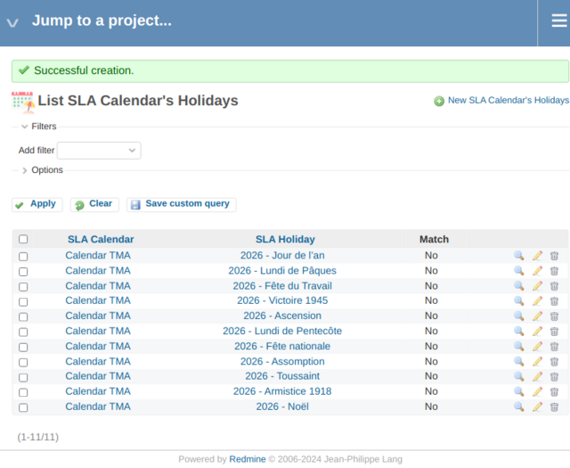

---

## 6) Create the project + enable SLA (same as EXAMPLE-01)

Create a test project (e.g., **Project Support**):

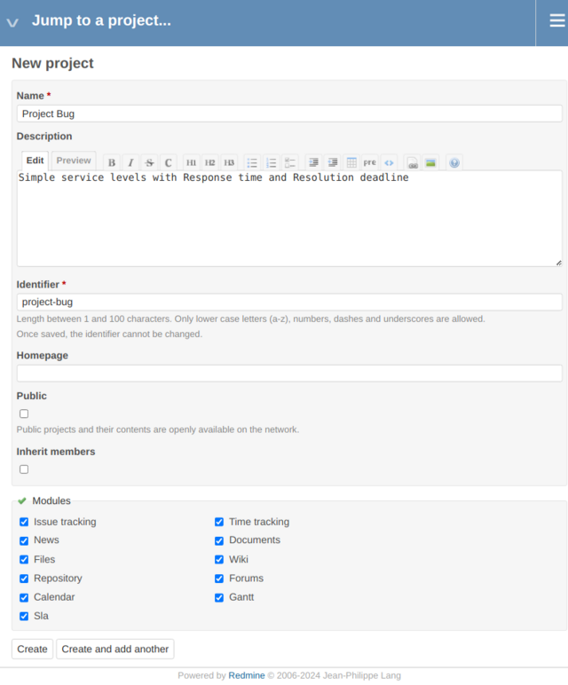

Verify the project:

Enable the SLA module in:

`Project → Settings → Modules`

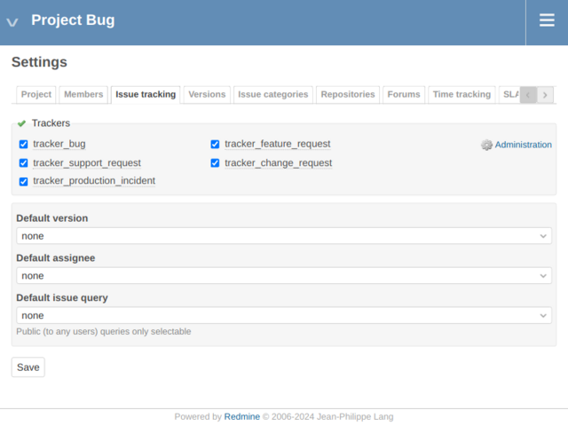

---

## 7) Create the SLA Level (same as EXAMPLE-01)

Go to:

`Administration → SLA Global settings → SLA Levels`

Create **Level Support** linked to:
- **SLA:** SLA Support
- **Calendar:** Calendar Support

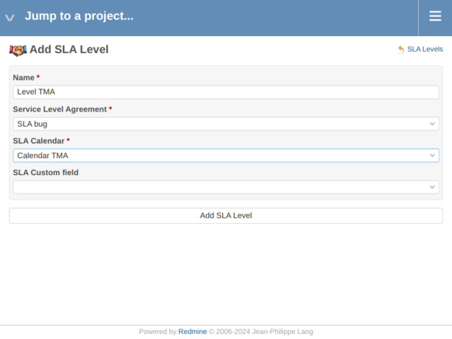

Verify it appears:

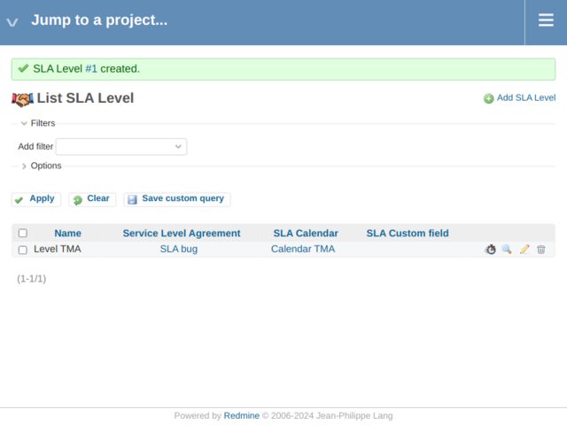

---

## 8) Define SLA Terms for BOTH SLA Types

Go to:

`Administration → SLA Global settings → SLA Terms`

### 8.1 Response time (GTI)

Create/update terms for **Response time** (same as EXAMPLE-01):

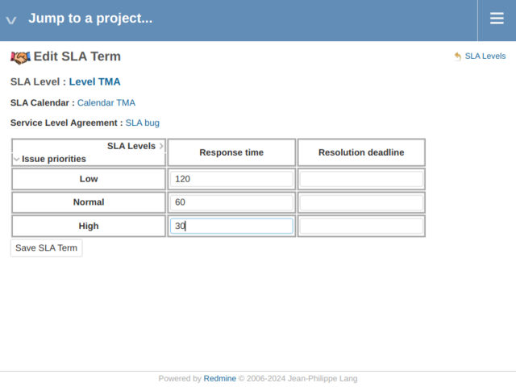

### 8.2 Resolution deadline (GTR) — new in this example

Create terms for **Resolution deadline**:

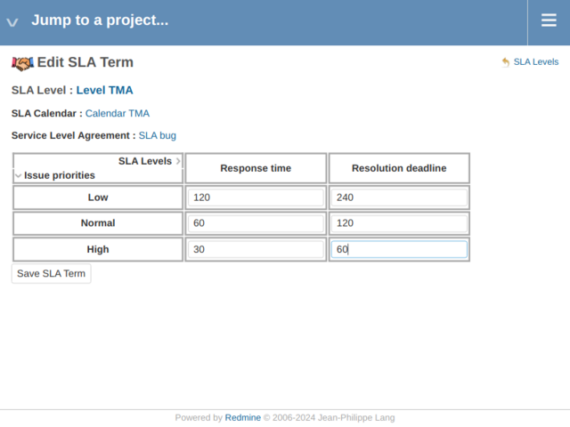

Verify the list contains both SLA Types:

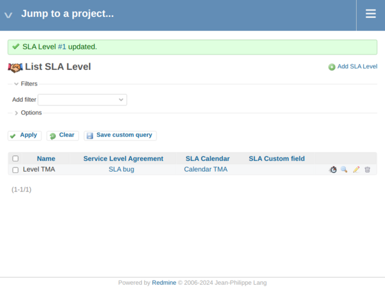

> **Pedagogical takeaway**  
> SLA Terms are defined **per (Level, Type, Priority)**.  
> That is why adding a new SLA Type requires adding a new set of terms.

---

## 9) Apply the SLA to the project tracker (same as EXAMPLE-01)

Go to:

`Project → Settings → SLA`

Open the SLA tab:

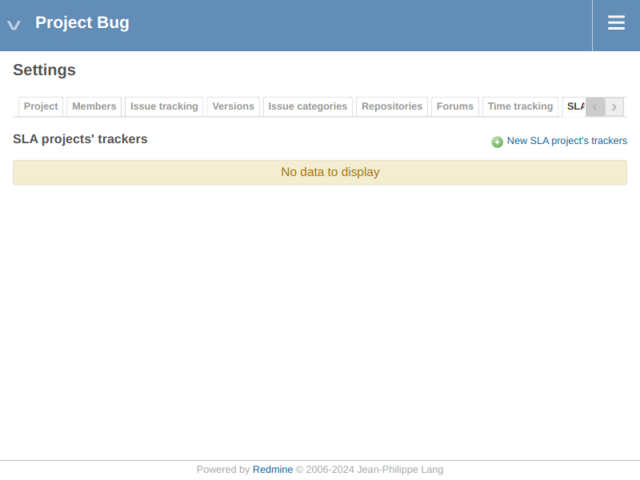

Create the mapping for the tracker (e.g., Support → SLA Support):

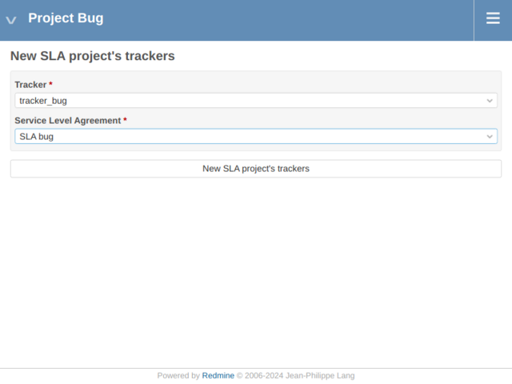

Verify the mapping:

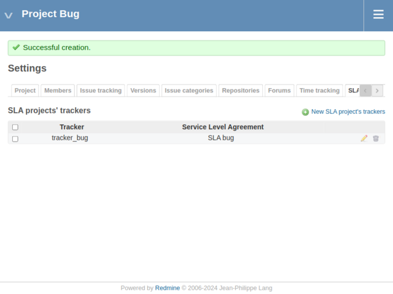

---

## 10) View GTI + GTR on issues

Create/open issues and change their status through your workflow.  
You should now see **two SLA commitments** evaluated on the issue page:

- **Response time (GTI)** while the issue is *New*
- **Resolution deadline (GTR)** while the issue is in the statuses you configured for that type

Example issue view:

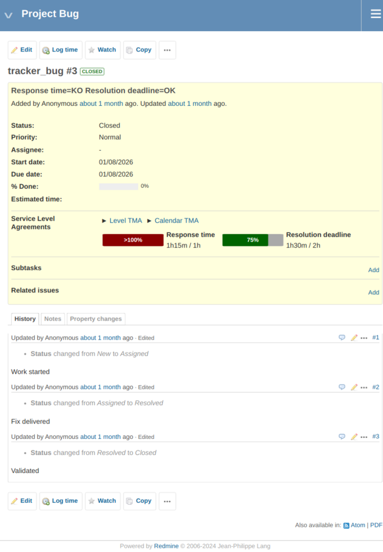

---

## What you learned in this example

With EXAMPLE-02, you learned that:

- a single SLA can contain **multiple commitments**
- each commitment is modeled as an **SLA Type**
- each SLA Type can have **different statuses**
- each SLA Type requires its own **SLA Terms**
- both commitments are displayed and evaluated independently on issues

The next example (EXAMPLE-03) will introduce a different facet: **multiple SLAs in the same project**, selected by the tracker.