# EXAMPLE-03 — Service levels with both *Bug* and *Request* in the same project

This third example introduces a new and important capability of the Redmine SLA plugin:
**using multiple SLAs within the same project**, depending on the **tracker**.

Up to now:
- EXAMPLE-01 showed a single SLA with one commitment (GTI)
- EXAMPLE-02 extended this SLA with a second commitment (GTR)

Here, we keep the same technical foundations, but we **duplicate the SLA logic** to support
different types of work (for example *Bugs* vs *Requests*) inside a single project.

---

## What this example adds compared to EXAMPLE-02

**One new facet only**:

- Multiple SLAs can coexist **in the same project**
- Each SLA is selected **by the issue tracker**

Everything else remains unchanged:
- working hours only (HO)
- priorities based on native Redmine priorities
- no custom field
- no HO/HNO advanced behavior

---

## What we want to achieve

We manage a single support project, but with **two different types of issues**:

1. **Bugs**
   - stricter response and resolution times
2. **Requests**
   - more flexible response and resolution times

Both issue types:
- live in the **same project**
- share the same working calendar
- have **different SLAs**

The SLA applied to an issue is determined **only by its tracker**.

---

## Target SLA design

### SLA 1 — Bug SLA

Applies to tracker: **Bug**

- Response time (GTI)
- Resolution deadline (GTR)
- Aggressive targets

### SLA 2 — Request SLA

Applies to tracker: **Request**

- Response time (GTI)
- Resolution deadline (GTR)
- More relaxed targets

---

## Key idea: SLA selection is tracker-based

In a project, the plugin evaluates SLAs in this order:

```
Issue
 └─ Tracker
     └─ SLA mapping (project level)
         └─ SLA definition
             ├─ SLA Types
             ├─ SLA Levels
             └─ SLA Terms
```

➡️ The **tracker** is the decision key.

---

## 1) Create the SLAs

Go to:

`Administration → SLA Global settings → Service Level Agreements`

Create **two SLAs**:

- `SLA Bug`
- `SLA Request`

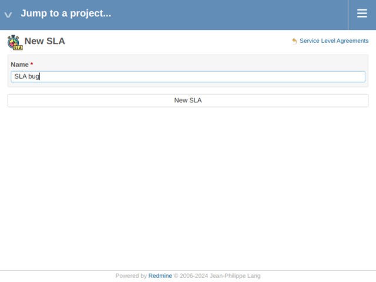

Verify both appear in the list:

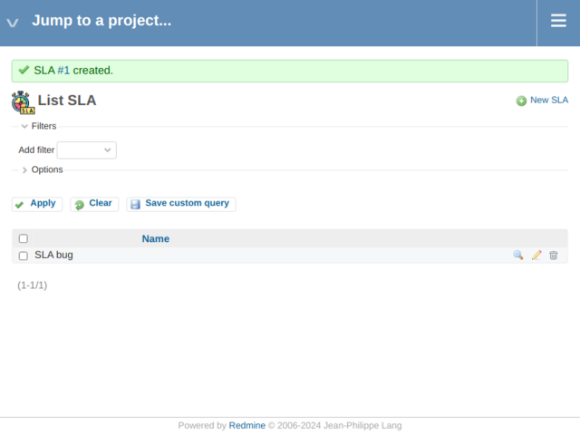

---

## 2) Create the SLA Types (same as EXAMPLE-02)

We reuse the same SLA Types for both SLAs:

- Response time
- Resolution deadline

Go to:

`Administration → SLA Global settings → SLA Types`

Create the types if they do not already exist:

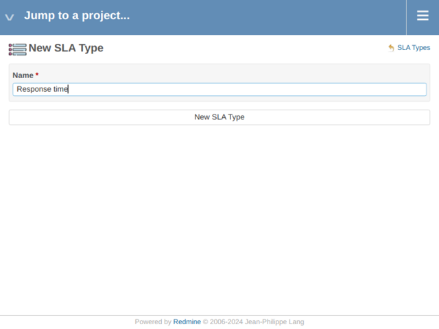

Verify the list:

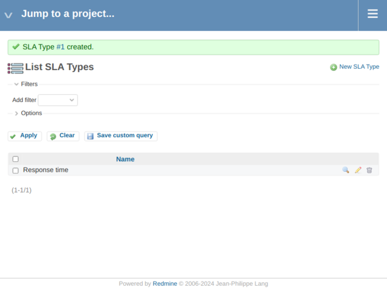

---

## 3) Define SLA Statuses (shared by both SLAs)

Go to:

`Administration → SLA Global settings → SLA Statuses`

Define when each SLA Type elapses:

- **Response time** → New
- **Resolution deadline** → In Progress (and related statuses)


Verify the list:

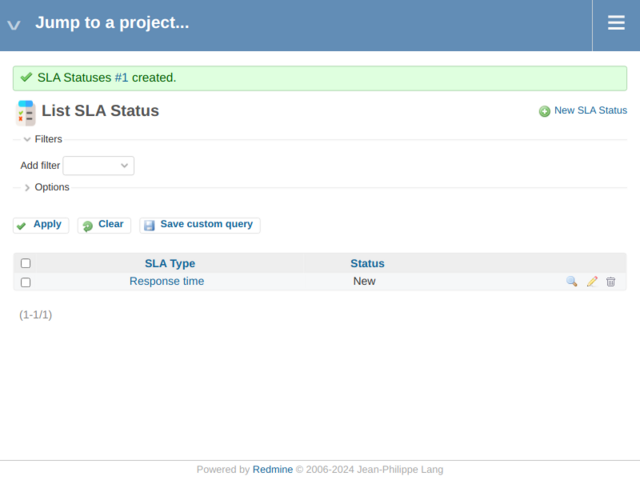

> SLA Statuses are **global**: they apply to all SLAs using the same SLA Type.

---

## 4) Create the SLA Calendar (shared)

Go to:

`Administration → SLA Global settings → SLA Calendars`

Create one calendar (same working hours as previous examples):

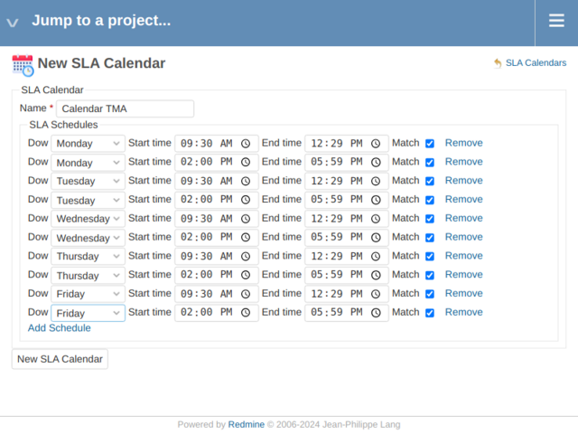

Verify the list:

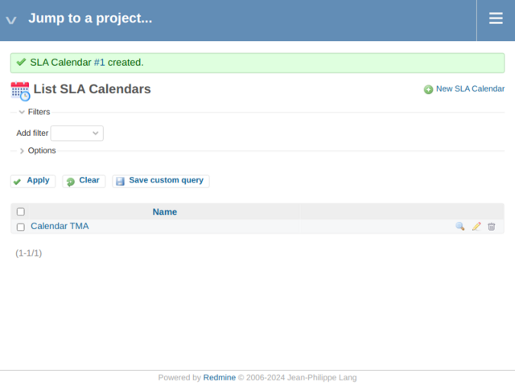

---

## 5) Create Holidays and assign them to the calendar

Create holidays (same logic as previous examples):

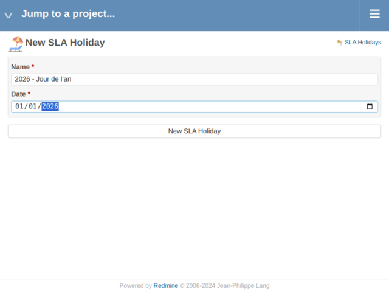

Verify the holiday list:

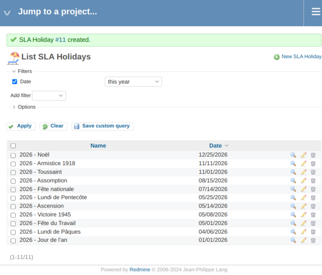

Assign holidays to the calendar:

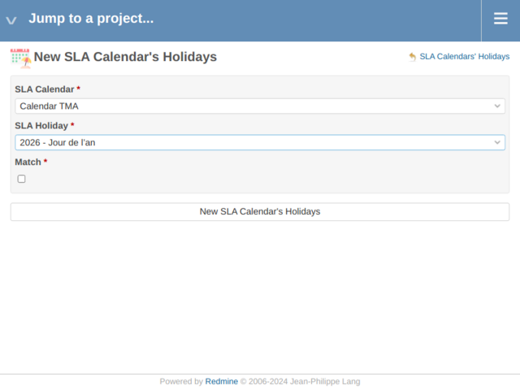

---

## 6) Create the project

Create a project that will host **both trackers**:

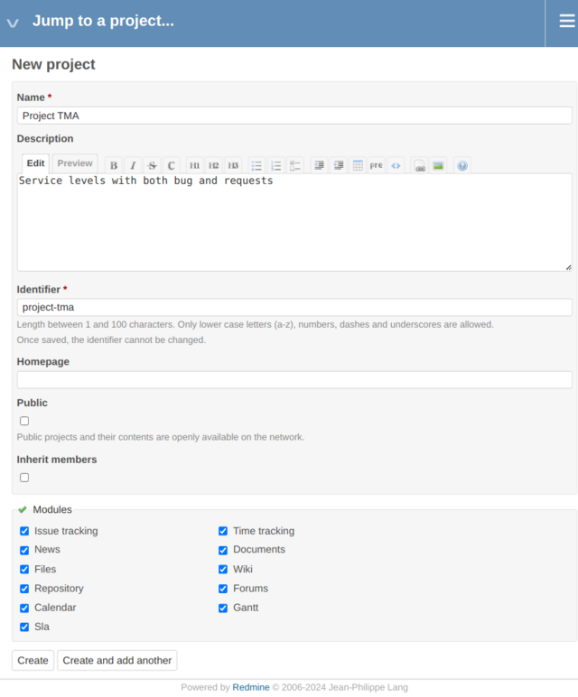

Verify the project:

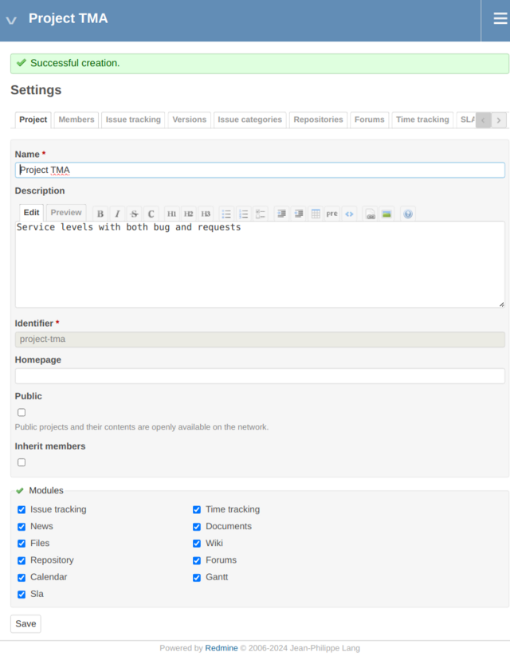

Enable the SLA module in project settings (same as previous examples).

---

## 7) Create SLA Levels (one per SLA)

Go to:

`Administration → SLA Global settings → SLA Levels`

Create two levels:

- `Level Bug` → linked to `SLA Bug`
- `Level Request` → linked to `SLA Request`

Both levels can use the **same calendar**.

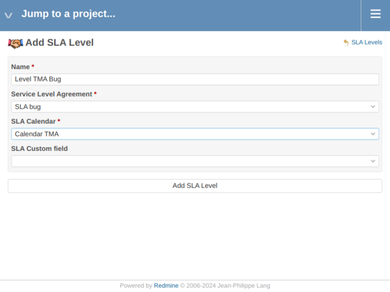

Verify the list:

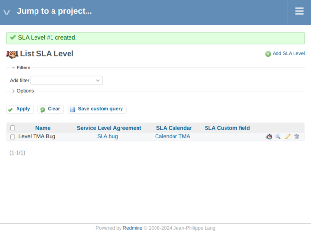

---

## 8) Define SLA Terms per SLA

Go to:

`Administration → SLA Global settings → SLA Terms`

### 8.1 Bug SLA Terms

Define stricter targets for **Bug**:

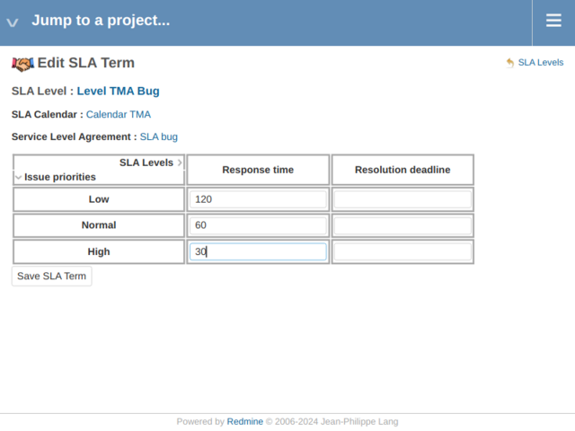

### 8.2 Request SLA Terms

Define more relaxed targets for **Request**:

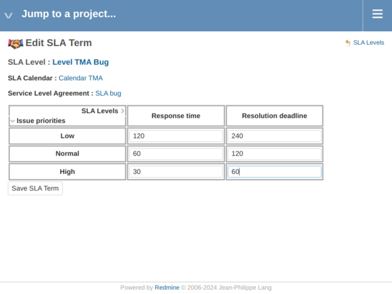

Verify the list:

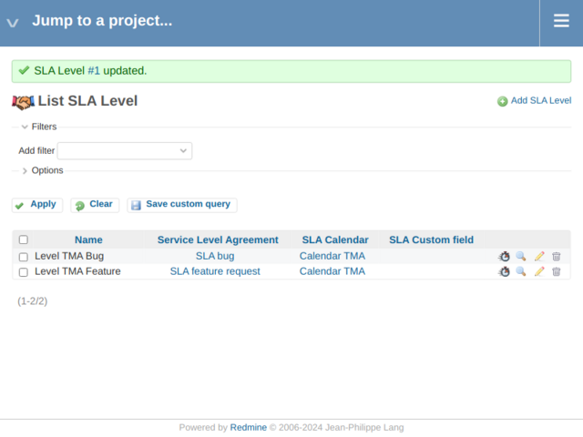

---

## 9) Map trackers to SLAs at project level

Go to:

`Project → Settings → SLA`

Create mappings:

- Tracker **Bug** → `SLA Bug`
- Tracker **Request** → `SLA Request`

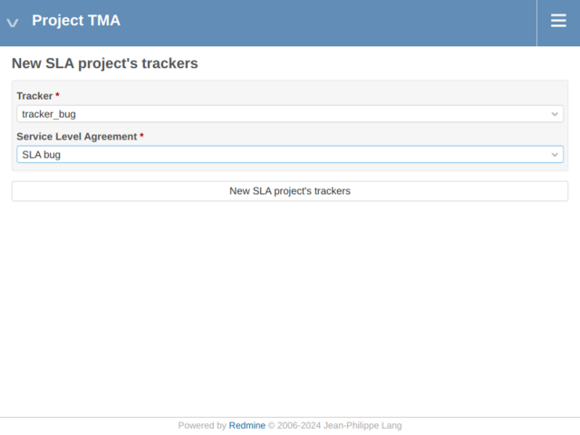

Verify mappings:

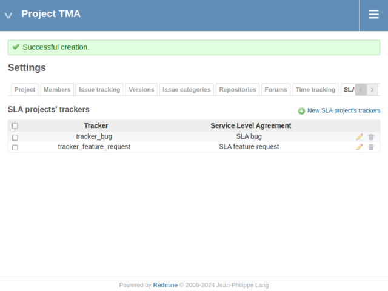

---

## 10) View SLAs on issues

Create two issues in the same project:
- one **Bug**
- one **Request**

Each issue will automatically use the SLA mapped to its tracker.

Example issue view:

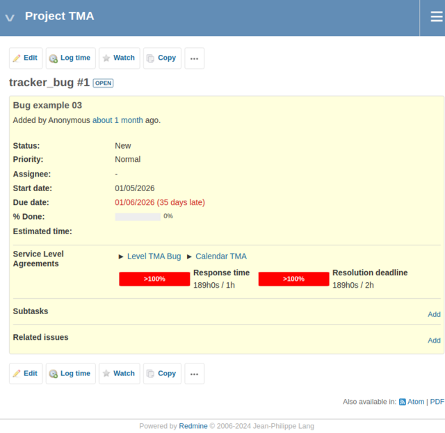

---

## What you learned in this example

With EXAMPLE-03, you learned that:

- multiple SLAs can coexist in a single project
- SLA selection is based on the **tracker**
- SLAs can share calendars and SLA Types
- SLA logic remains isolated per SLA definition

The next example (EXAMPLE-04) will introduce **custom fields for SLA priority**, allowing even more flexibility.