# EXAMPLE-04 — Service levels with a custom field for SLA priority

This fourth example introduces a **major functional extension** of the Redmine SLA plugin:
using a **custom field** to define the SLA priority instead of relying on Redmine’s native issue priority.

This example is **explicitly based on EXAMPLE-01**, and reuses its configuration logic
(single SLA, single level, working hours only), while changing **how priorities are evaluated**.

---

## What this example adds compared to EXAMPLE-01

**One new facet only**:

- SLA priority is no longer derived from the native Redmine issue priority
- A **custom field** is used to determine SLA targets

Everything else remains unchanged:
- one SLA
- one SLA Level
- working hours only (HO)
- one tracker
- no multi-SLA per project
- no HO/HNO advanced behavior

> ⚠️ This example intentionally **does not build on EXAMPLE-03**.  
> We focus on *priority modeling*, not SLA selection.

---

## Why using a custom field for SLA priority

In many real-life projects:
- Redmine priority is used for **global issue ordering**
- SLA priority follows **contractual rules**
- SLA priority can differ:
  - between projects
  - between customers
  - between SLA Levels

Using a custom field allows:
- full control of SLA priority
- different priority scales per SLA Level
- independent evolution from Redmine core settings

---

## What we want to achieve

For a support project:
- issues still have a native Redmine priority
- **SLA targets are driven by a custom field**
- the same SLA logic as EXAMPLE-01 applies

Example SLA priority values:
- Bronze
- Silver
- Gold

---

## Key idea: SLA priority is abstracted

Conceptually:

```
Issue
 ├─ Redmine priority (native)
 └─ SLA priority (custom field)
        └─ SLA Terms selection
```

➡️ SLA Terms no longer depend on `issue.priority_id`,
but on the **value of the configured custom field**.

---

## 1) Create the SLA (same as EXAMPLE-01)

Go to:

`Administration → SLA Global settings → Service Level Agreements`

Create a new SLA named **“SLA Support”**.

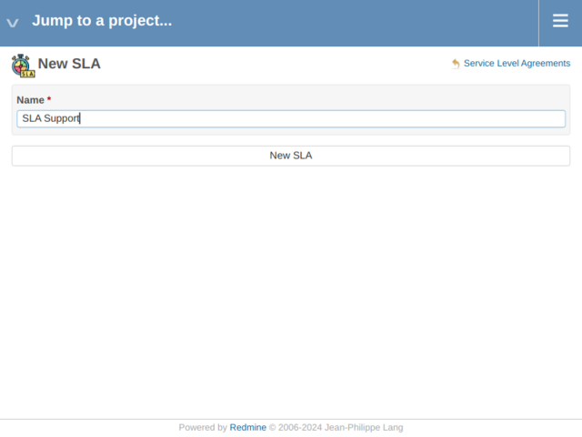

Verify it appears in the list:

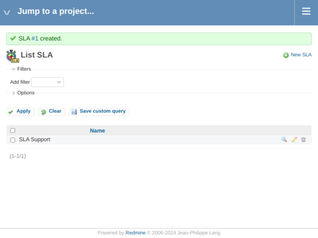

---

## 2) Create the SLA Type (same as EXAMPLE-01)

Go to:

`Administration → SLA Global settings → SLA Types`

Create **Response time**:

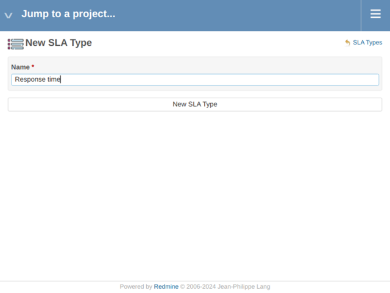

Verify the list:

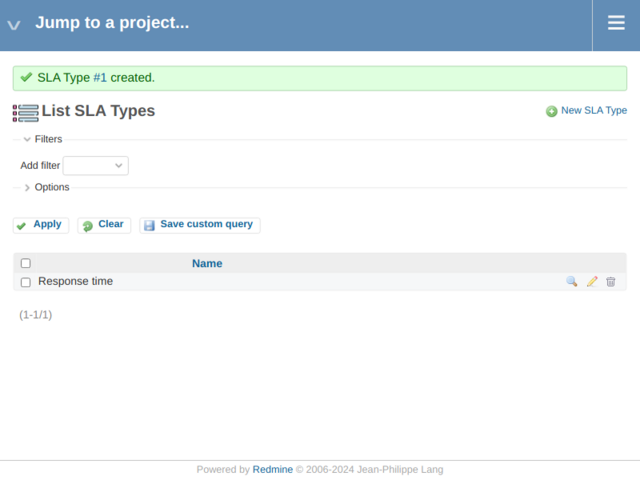

---

## 3) Define SLA Statuses (same as EXAMPLE-01)

Go to:

`Administration → SLA Global settings → SLA Statuses`

Configure **Response time** to elapse while the issue is in status **New**:

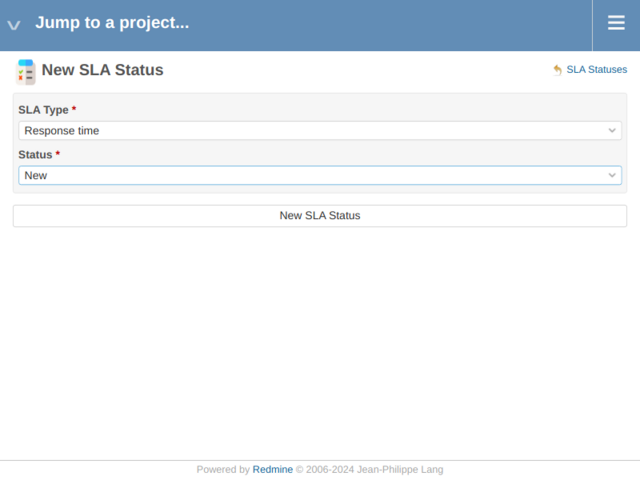

Verify the list:

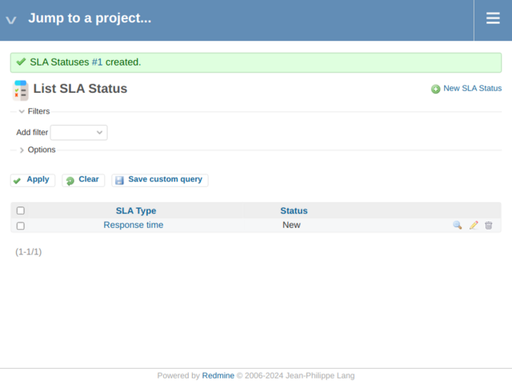

---

## 4) Create the SLA Calendar and Holidays (same as EXAMPLE-01)

Create the working calendar:

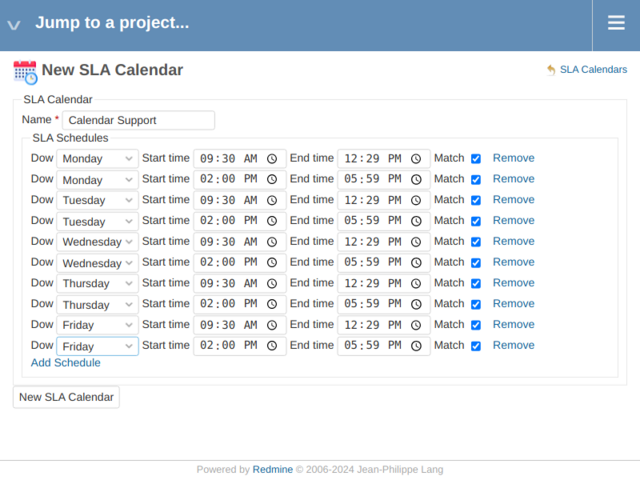

Verify the calendar list:

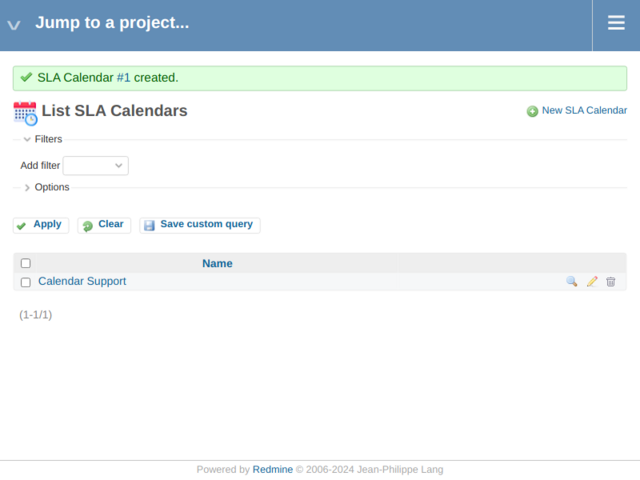

Create holidays:

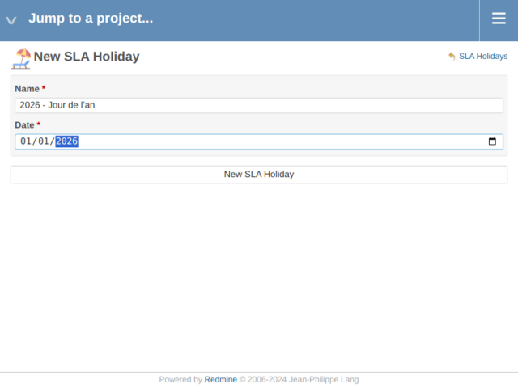

Verify the holiday list:

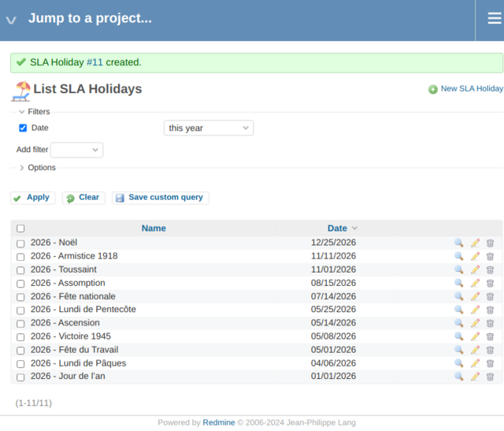

Assign holidays to the calendar:

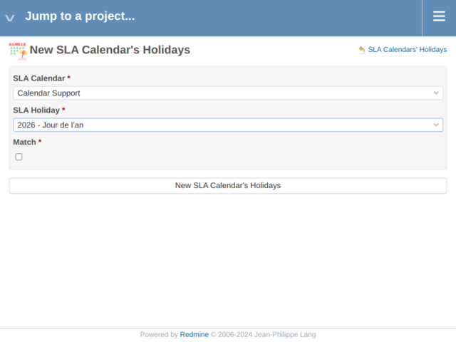

Verify mappings:

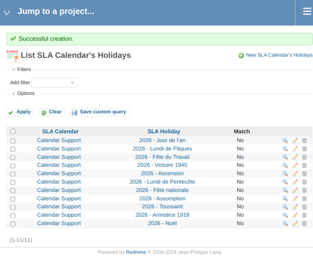

---

## 5) Create the custom field used for SLA priority

Go to:

`Administration → Custom fields → Issues`

Create a new custom field:
- **Name:** SLA Priority
- **Type:** List (or Key/Value list)
- **Values:** Bronze / Silver / Gold

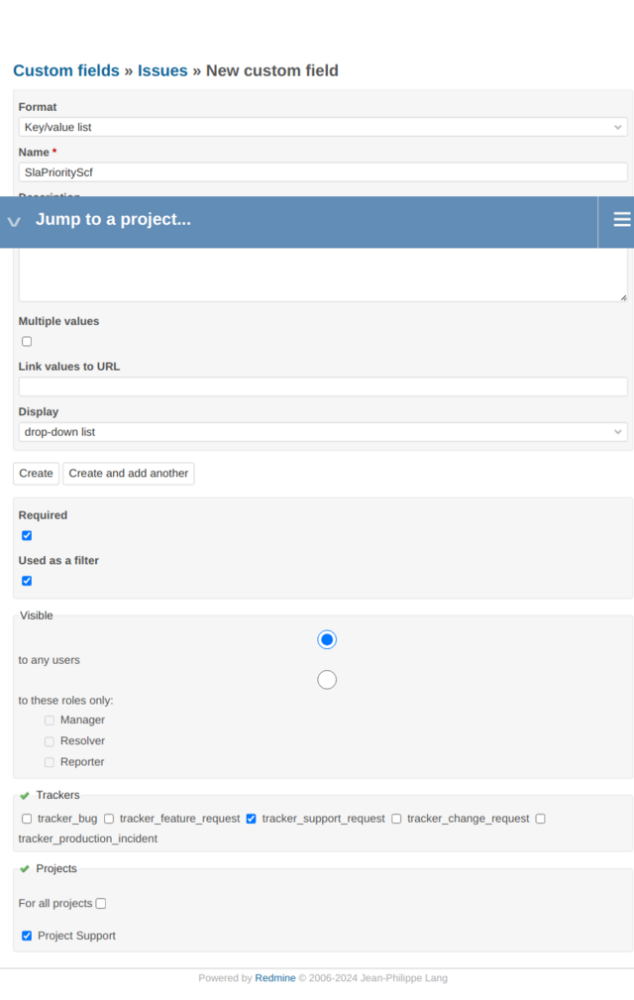

Define the allowed values:

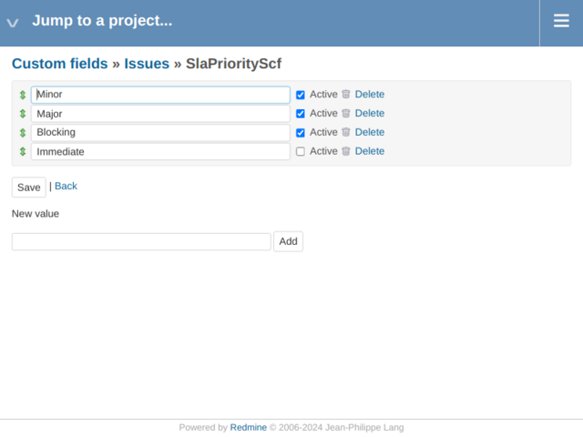

Finalize the custom field:

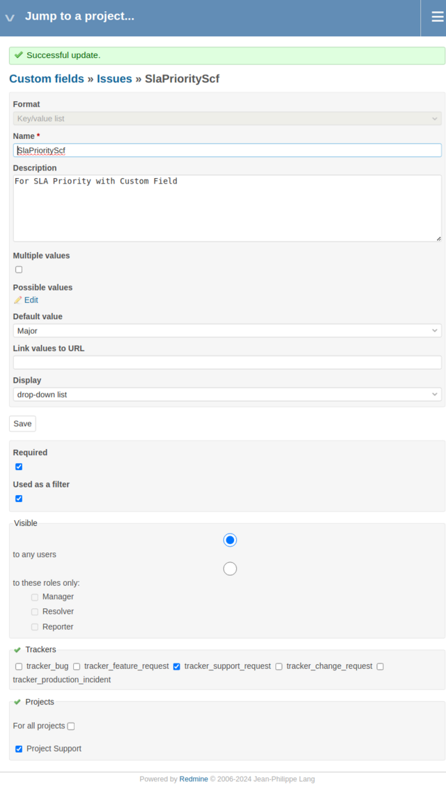

> This custom field will be referenced later by the SLA Level.

---

## 6) Create the project and enable SLA

Create a support project:

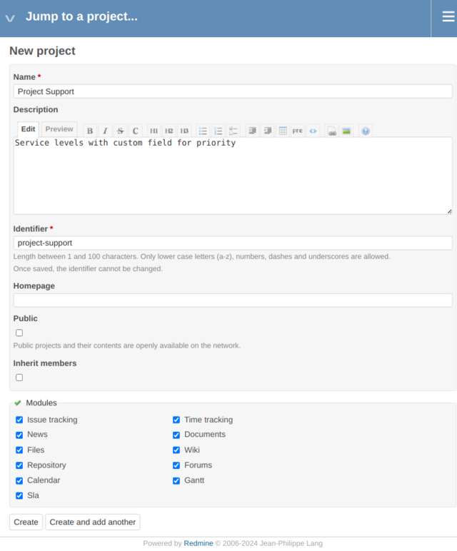

Verify the project:

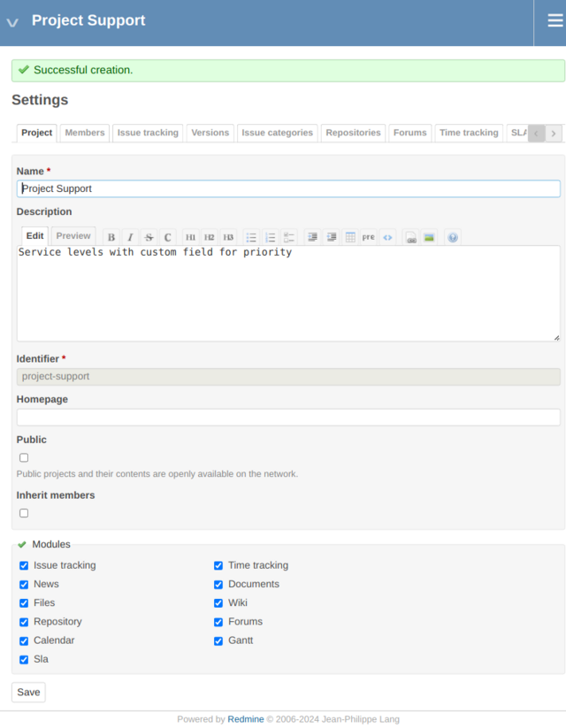

Enable the SLA module:

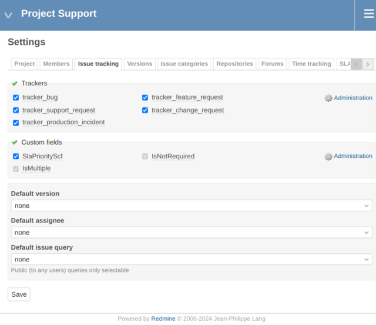

---

## 7) Create the SLA Level and bind the custom field

Go to:

`Administration → SLA Global settings → SLA Levels`

Create **Level Support** and configure:
- **SLA:** SLA Support
- **Calendar:** Calendar Support
- **SLA priority custom field:** SLA Priority

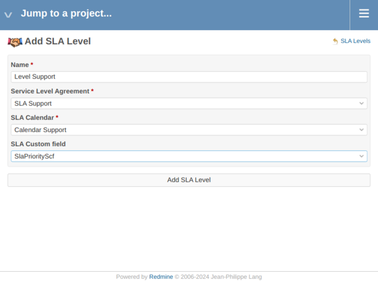

Verify the list:

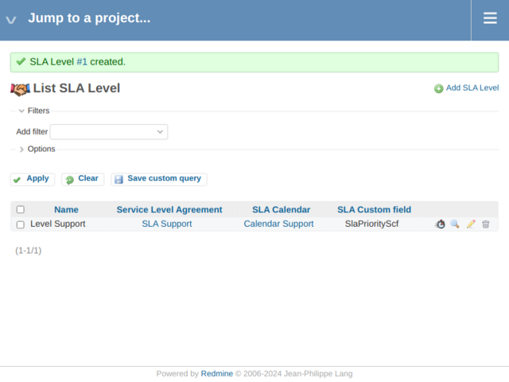

> **Pedagogical takeaway**  
> The SLA Level is the point where **priority logic is injected**.

---

## 8) Define SLA Terms using the custom field values

Go to:

`Administration → SLA Global settings → SLA Terms`

Create SLA Terms for **Response time**, based on the **custom field values**:

| SLA Priority | Target |
|-------------|--------|
| Minor | 24h |
| Major | 8h |
| Block | 4h |

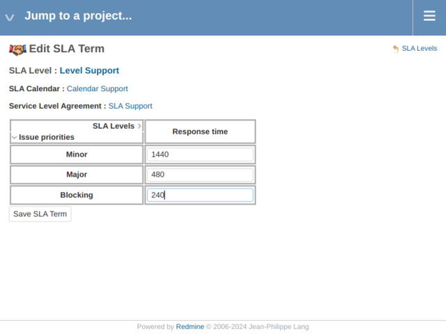

Verify the list:


---

## 9) Map the SLA to the project tracker

Go to:

`Project → Settings → SLA`

Create the mapping for your tracker:

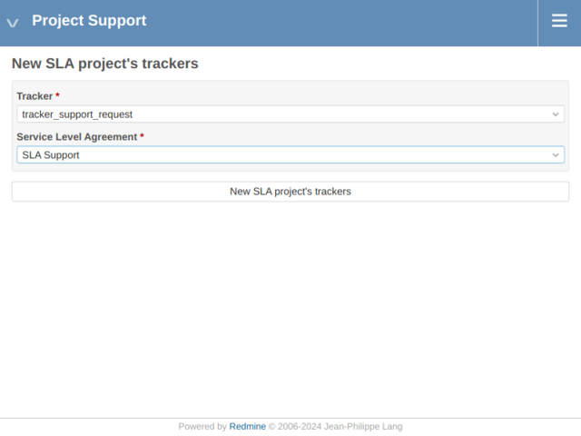

Verify the mapping:

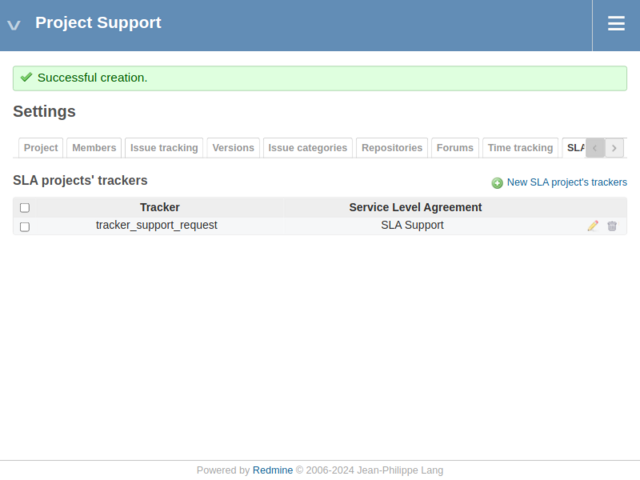

---

## 10) View SLA behavior on issues

Create issues and set the **SLA Priority** custom field.

The SLA displayed on the issue will now depend on:
- the custom field value
- not the native Redmine priority

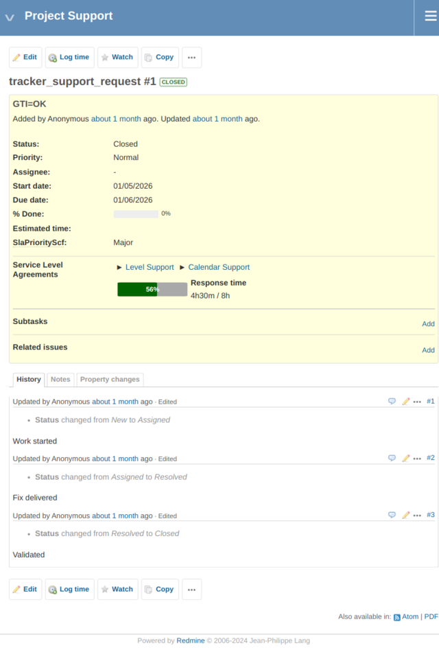

---

## What you learned in this example

With EXAMPLE-04, you learned that:

- SLA priority can be fully decoupled from Redmine priority
- custom fields allow advanced SLA modeling
- SLA Levels define *how* priority is interpreted
- the same SLA logic can adapt to different contractual needs

The next and final example (EXAMPLE-05) will cover **complex service levels combining working and non-working hours (HO/HNO)**.