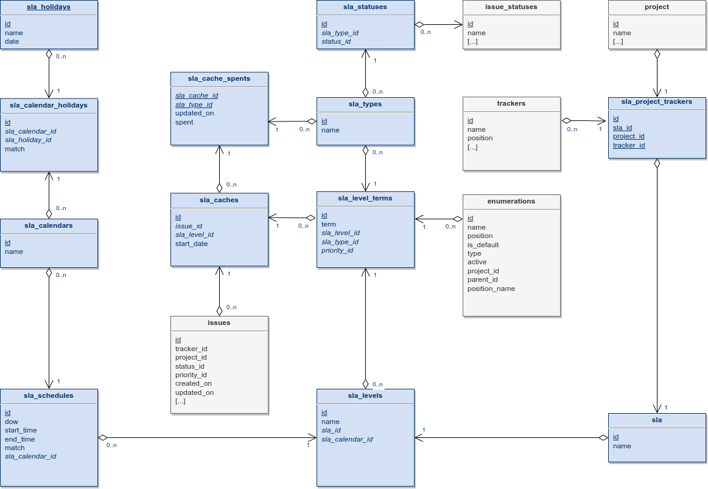

# Conceptual Data Model

## Overview

During installation, thirteen tables are created :
- slas : all SLA
- sla_calendars : a calendar for SLA
- sla_holidays : list of holidays
- sla_calendar_holidays : allocation of holidays to calendars
- sla_schedules : hourly covers
- sla_types : SLA types (ex: response time guarantee or resolution time guarantee)
- sla_levels : Name of a SLA level
- sla_level_terms : Terms of SLA relative to SLA level, SLA type and priority_id
- sla_project_trackers : SLA level to apply to a tracker of a project
- sla_statuses : list of active statuses for a SLA level
- sla_caches : caching of the SLA level of the issues (obtained with "sla_get_level") 
- sla_cache_spents : caching spent of issues (obtained with "sla_get_spent") 
- sla_logs : not yet used (even if the loglevel can be set in the plugin configuration)

With three functions :
- sla_get_date : adjusts a date according to the plugin's time zone
- sla_get_level : identifies the start date of the SLA and the associated level
- sla_get_spent : the heart of the plugin responsible for calculating the times spent

And one view :
- sla_view_journals : rebuilds issues status journal from its creation to "now"

## Drawing

## Comments
...