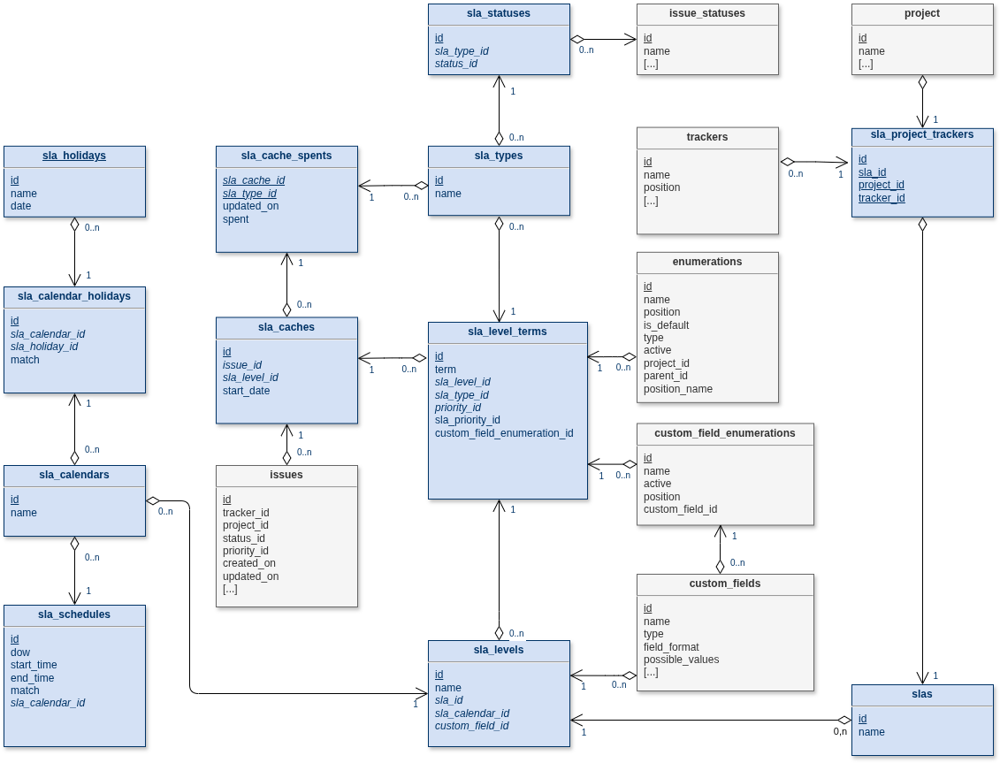

# Conceptual Data Model

## Overview

During installation, thirteen plugin-specific tables are created:

-   **slas** : all SLA definitions
-   **sla_calendars** : calendars attached to an SLA
-   **sla_holidays** : list of holidays
-   **sla_calendar_holidays** : allocation of holidays to calendars
-   **sla_schedules** : working time ranges (day-of-week, start/end
    time)
-   **sla_types** : SLA types (e.g. response time, resolution time)
-   **sla_levels** : logical SLA levels attached to an SLA
-   **sla_level_terms** : SLA terms defined per level, type and priority
    pivot
-   **sla_project_trackers** : SLA assignment per project and tracker
-   **sla_statuses** : active statuses per SLA type
-   **sla_caches** : cache of computed SLA level per issue (via
    `sla_get_level`)
-   **sla_cache_spents** : cache of computed spent time (via
    `sla_get_spent`)
-   **sla_logs** : internal logging table (currently not actively used)

------------------------------------------------------------------------

## External Redmine Tables Referenced

The plugin relies on several Redmine core tables but does not create
them:

-   **issues**
-   **issue_statuses**
-   **trackers**
-   **projects**
-   **enumerations** (used for priorities)
-   **custom_field_enumerations** (used when SLA priority is based on a
    custom field)

------------------------------------------------------------------------

## Database Functions

Three PostgreSQL functions are created:

-   **sla_get_date** : adjusts a date according to the plugin time zone
-   **sla_get_level** : determines the SLA level and start date for an
    issue
-   **sla_get_spent** : computes effective time spent according to
    calendar rules

------------------------------------------------------------------------

## Database Views

Two SQL views are created:

-   **sla_view_journal_statuses** : simplifies selection of journal
    status changes
-   **sla_view_roll_statuses** : reconstructs issue status timeline from
    creation to now

------------------------------------------------------------------------

## Detailed Notes

### sla_level_terms (Priority Handling)

This table defines SLA durations (`term`) per:

-   `sla_level_id`
-   `sla_type_id`
-   `sla_priority_id` (internal pivot key)

Priority resolution supports two modes:

1.  **Redmine native priority**
    -   `priority_id` → references `enumerations`
2.  **Custom field enumeration priority**
    -   `custom_field_enumeration_id` → references
        `custom_field_enumerations`

Business rule:

-   Exactly one of `priority_id` OR `custom_field_enumeration_id` must
    be defined.
-   `sla_priority_id` acts as a stable pivot used in unique constraints
    and caching.

A unique index ensures one term per:

    (sla_level_id, sla_type_id, sla_priority_id)

------------------------------------------------------------------------

## Logical Layers

### 1. Definition Layer

-   slas
-   sla_levels
-   sla_types
-   sla_level_terms

### 2. Calendar Layer

-   sla_calendars
-   sla_schedules
-   sla_holidays
-   sla_calendar_holidays

### 3. Scope Layer

-   sla_project_trackers
-   sla_statuses

### 4. Runtime / Computation Layer

-   sla_caches
-   sla_cache_spents
-   sla_logs

------------------------------------------------------------------------

## Drawing

The conceptual diagram is available in:

The editable source file is:

[Download redmine_sla_mcd.drawio](mcd/redmine_sla_mcd.drawio)

------------------------------------------------------------------------

## Comments

The data model is designed to:

-   Separate SLA definition from calendar computation
-   Allow flexible priority resolution (native or custom field)
-   Optimize runtime performance through caching tables
-   Keep strong referential integrity between SLA layers and Redmine
    core tables